# Tarea 3

## Pregunta 1: A partir de los datos, encontrar la mejor curva de ajuste (modelo probabilístico) para las funciones de densidad marginales de X y Y.

Se importan distintas librerias para la realizacio en general del programa. En especial la libreria pandas, para asi poder leer el documento .csv y sus datos. Para esta parte entonces se procede a sumar los valores de las columnas Y y los valores de las filas X para poder encontrar su total. Se crean dos listas diferentes para asi almacenar las sumas de cada columna y fila como un vector de X y de Y, tanto de manera horizontal para las X y de manera vertical para las Y. EN las siguientes graficas se ve el comportamiento de estos datos ya sumados.

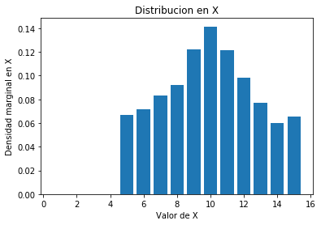
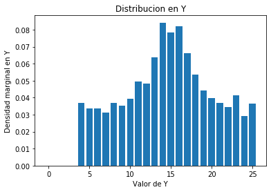

Siguientemente ya con estas figuras podemos encontrar una curva de ajuste. En este caso debido a la composicion podemos ajustar las dos graficas a una gaussina. Encontramos los parametros para los valores en X y en Y. Los cuales dan como resultado en X, [mu=10.0120696 ,sigma=3.19804209 ], para Y dando como resultados [mu=15.01506038 ,sigma=6.04857283 ]. Las curvas de ajuste son las siguientes


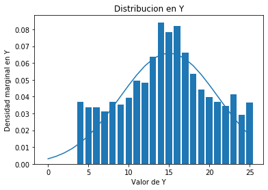

## Pregunta 2: Asumir independencia de X y Y. Analíticamente, ¿cuál es entonces la expresión de la función de densidad conjunta que modela los datos?

Debido al ajuste que le dimos, se usa la funcion gaussiana para este calculo. La funcion gaussiana se ve en la siguiente imagen.

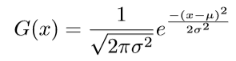

Ademas de que sabemos que la funcion de densidad conjunta es la siguiente.

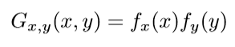

Por lo que hacemos los calculos para cada funcion de X y Y , luego las multimplicamos y encontramos el resultado final como se ve en la siguiente imagen.

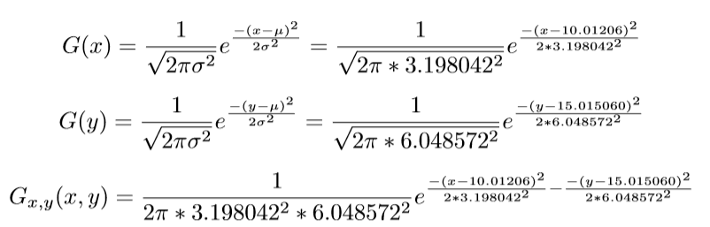


##Pregunta 3: Hallar los valores de correlación, covarianza y coeficiente de correlación (Pearson) para los datos y explicar su significado.


La funcion para poder encontrar la correlacion es la siguiente:

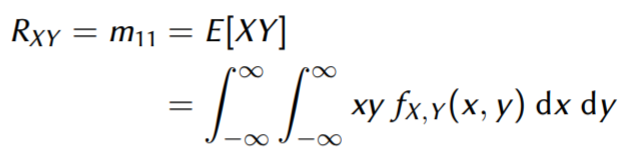

Del analisis de la formula concluimos que se debe crear un programa que multiplique el valor de X por el valor de Y por el valor de frecuencia relativa en cada caso. Como por ejemplo 5x5x0.00262 y asi sucesivamente para todas las entradas y sumarlas. Se hace al calculo mediante un for y nos da como resultado 149.54281000000012. Sabemos que la correlacion es la medida o cantidad de relacion entre dos variables, por lo que mientras mas grande el numero, las variables estan linealmente asociadas. 

Luego para la covarianza usamos la siguiente formula.


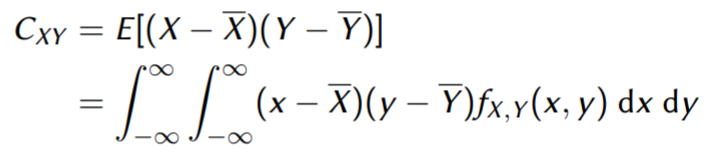

Por lo que al igual que con la correlacion, creamos un for que para cada entrada de X y Y reste la media de cada uno y los vaya sumando,mas que ya sabemos los valores de la media debido al mu entregado por los parametros. Ademas de multiplicarlos por su frecuencia. El programa nos entrega una covarianza de 0.06543408767088855. Esto lo que nos indica es un tipo de relacion de dispersion entre las dos variables. Siendo positivo esto indica que cuando una crece la otra tambien debido a la relacion directa que contienen.

Finalmente para el coeficiente de correlacion, con el programa dividimos la covarianza entre los sigma encontrados para cada variable. Usando la siguiente formula.

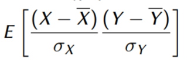

Con el valor de covarianza ya encontrado, la formula nos da como resultado 0.0033827270929922353. Este da como resultado postiva, por lo que al aumentar el valor de la variable, la relacion dice que esta aumenta y la otra tambien.


Finalmente al correr el programa obtenemos como respuesta lo siguiente.

```python
Correlacion: 149.54281000000012
Covarianza: 0.06543408767088855
Coeficiente de Correlacion: 0.0033827270929922353
```

## Pregunta 4: Graficar las funciones de densidad marginales (2D), la función de densidad conjunta (3D).

De la curva de ajuste encontrada previamente podemos encontrar las imagenes en 2D para X y Y. Las graficas encontradas son las siguientes.

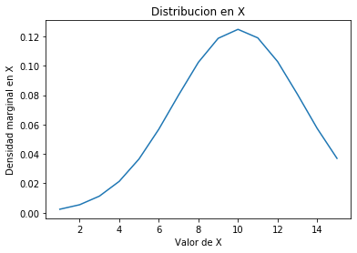 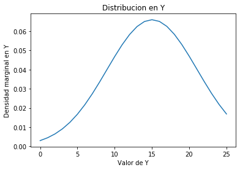

Para la graficacion 3D usamos la libreria Axes3D. Dandonos como resultado la siguiente grafica.

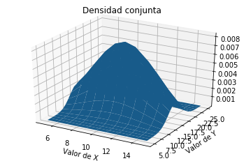


